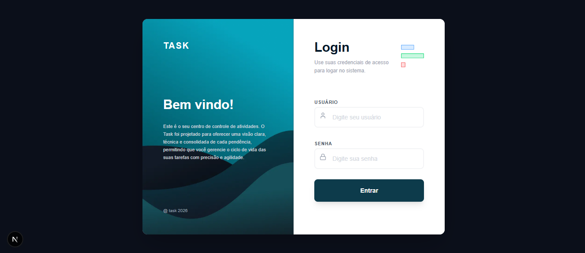
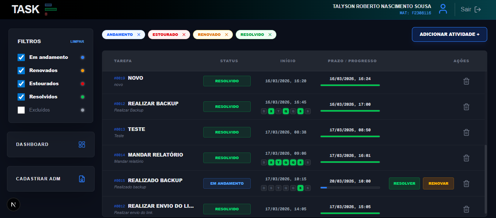
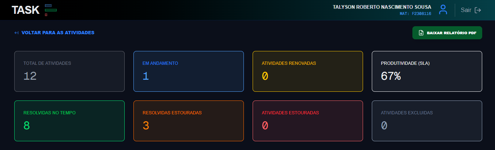
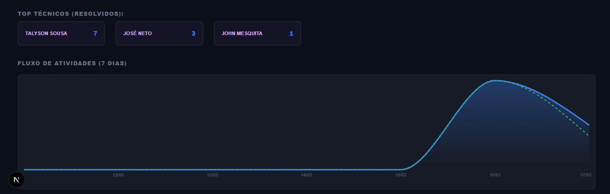
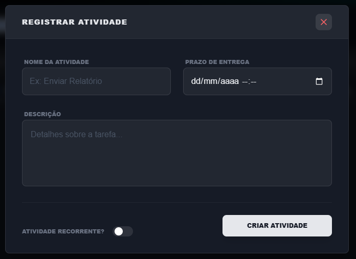
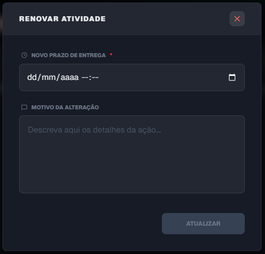
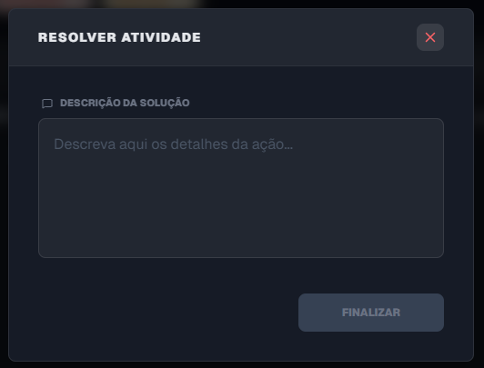
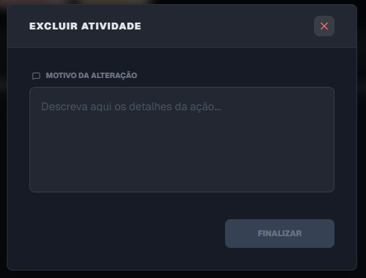
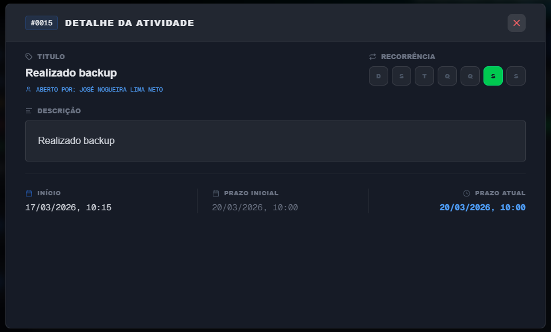
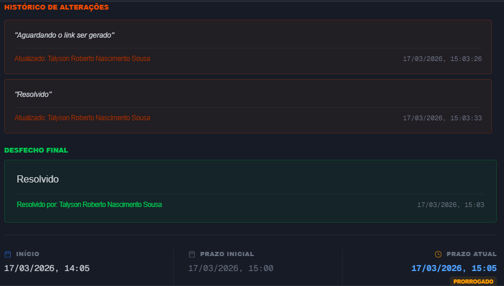

# 🚀 Task: Gerenciador de Atividades & Business Intelligence

O **Task** é uma solução Full-Stack para gestão de chamados e monitoramento de SLA em tempo real. Integra uma interface técnica de alta performance com automações via **Microsoft Power Automate** e um painel analítico para tomada de decisão.

# 🖥️ O que há de novo?

**🔐 Controle de Acesso (ACL):** Sistema de permissões baseado em perfis (ADM e JEDI) persistidos em JSON.
**📊 Dashboard BI:** Visualização de indicadores de produtividade, SLA e performance de técnicos.
**📄 Relatórios PDF:** Geração dinâmica de relatórios de atividades para usuários autorizados.
**🛡️ Gestão de Usuários:** Interface administrativa para cadastro de novos gestores via integração com API Lanlink.

---

# Pages
**Login**


**Home**


**Dashboard**



# Modais
**Registra Atividade**


**Renova Atividade**


**Resolve e exclue Atividade**



**Dados Atividade (Historico)**



---

# 🛠️ Tecnologias Utilizadas

**Core:** Next.js 16 (Turbopack)
**Styling:** Tailwind CSS (Aesthetic Technomancer/Dark Mode)
**Charts:** Recharts (Evolução de 7 dias)
**PDF:** jsPDF / jsPDF-AutoTable
**Icons:** Lucide React
**Automation:** Power Automate (Adaptive Cards)

---

# 📦 Instalação e Setup

Clonar o projeto

```bash
git https://DEV-CGS@dev.azure.com/DEV-CGS/Projetos%20CGS/_git/Painel-Atividades
cd Painel-Atividades
```

Instalar dependências

```bash
npm install
```

---

# ⚙️ Estrutura de Dados e Segurança

O sistema **Task** utiliza persistência híbrida:
**atividades.json:** Armazena o corpo técnico das tarefas.
**usuarios.json:** Armazena os perfis autorizados a acessar o Dashboard e gerar relatórios.

Certifique-se de que a pasta **data/** existe na raiz do projeto:

```text
Painel-Atividades
├─ app/ (Rotas e API)
├─ data/
│   ├─ atividades.json
│   └─ usuarios.json
└─ lib/ (Lógica de Auth e Monitor)
```

---

# ⚙️ Configuração do Power Automate

O fluxo permanece via gatilho HTTP POST. No arquivo **lib/monitor.ts**, configure sua URL:

```javascript
const POWER_AUTOMATE_URL = "SUA_URL_AQUI"
```

---

# 🛡️ Funcionalidades Avançadas

### 📊 Painel de Estatísticas
Acessível apenas por usuários cadastrados no sistema Task, o Dashboard monitora:
**SLA de Produtividade:** Cálculo automático de chamados resolvidos no prazo vs. estourados.
**Top Técnicos:** Ranking dinâmico baseado em resoluções.
**Gráfico de Evolução:** Fluxo de atividades dos últimos 7 dias via Recharts.

### 🔐 Sistema de Permissões
**Nível ADM:** Permite visualizar indicadores, abertura de tarefas e download de relatório.
**Nível JEDI:** Permissão total, incluindo exclusão de tarefas e criação de novas permições para usuários.

# 🚀 Executar em Desenvolvimento

```bash
npm run dev
```

---

### 📝 Créditos do Projeto

**Project:** Task - Gerenciador de Atividades  
**Desenvolvido por:** [Talyson Roberto](https://github.com/TalysonRoberto)  

**Colaboração de:** [José Nogueira](https://github.com/netonog)  
**Revisado por:** [John William](https://github.com/johnwilliamam)

---